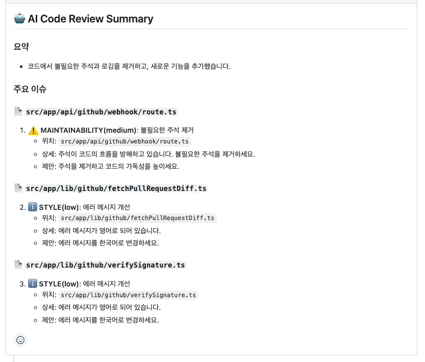

# GitHub PR AI Agent 🤖

> **GitHub App + Webhook + OpenAI 통합 자동 코드 리뷰 시스템**

[](https://www.typescriptlang.org/)
[](https://nextjs.org/)
[](https://openai.com/)
[](https://github-pr-ai-agent.vercel.app)

GitHub Pull Request 생성 시 코드 변경 사항을 분석하고,
OpenAI를 활용해 자동으로 구조화된 코드 리뷰를 남기는 GitHub App입니다.

## 📸 데모



> 🔗 **라이브**: [github-pr-ai-agent.vercel.app](https://github-pr-ai-agent.vercel.app)

## 🎯 제작 배경

개인 프로젝트에서 PR 리뷰어가 있으면 어떨까 하는 생각에 AI를 활용하여
GitHub App과 Webhook을 학습하며 자동화된 코드 리뷰 시스템을 구현해보았습니다.

## 🏗 시스템 구조

- **GitHub App & Webhook**: PR 이벤트 자동 감지
- **PR Diff 분석**: 변경된 코드만 추출하여 분석
- **LLM 리뷰 생성**: OpenAI API로 구조화된 리뷰 작성
- **Vercel 서버리스**: 배포 및 운영 환경

## ✨ 주요 기능

- **이벤트 자동 감지**: PR opened, synchronize, reopened 시 자동 실행
- **코드 분석**: PR diff 기반으로 변경 사항만 분석
- **구조화된 리뷰**: 모범 사례와 개선 이슈를 구분하여 리뷰 작성
- **중복 방지**: commit SHA 기준으로 중복 리뷰 방지
- **자동 등록**: GitHub PR Review 댓글로 자동 등록

## 🛠 기술 스택

- **Framework**: Next.js (API Routes)
- **Language**: TypeScript
- **AI**: OpenAI API
- **Deployment**: Vercel (서버리스)
- **Integration**: GitHub App & Webhook

## 🚀 사용 방법

### 1. GitHub App 설치

이 앱을 설치하려면 GitHub App으로 등록해야 합니다.

### 2. Webhook 설정

- Webhook URL: `https://your-domain.vercel.app/api/webhook`
- Events: Pull Request (opened, synchronize, reopened)

### 3. 환경 변수 설정
```env
GITHUB_APP_ID=your_app_id
GITHUB_PRIVATE_KEY=your_private_key
GITHUB_WEBHOOK_SECRET=your_webhook_secret
OPENAI_API_KEY=your_openai_key
```

### 4. PR 생성

레포지토리에 PR을 올리면 자동으로 AI 리뷰가 등록됩니다.

## 📦 프로젝트 구조
```
src/
  ├── app/
  │   └── api/
  │       └── webhook/       # GitHub Webhook 엔드포인트
  └── lib/
      ├── github.ts         # GitHub API 클라이언트
      └── openai.ts         # OpenAI 리뷰 생성
public/
  └── ...                   # 정적 파일
```

## 📌 작동 방식

1. PR 생성 → Webhook 발동
2. PR diff 추출 및 분석
3. OpenAI로 리뷰 생성 (JSON 구조화)
4. GitHub API로 PR 댓글 자동 등록
5. Commit SHA 저장 (중복 방지)

## 💡 핵심 구현

### Webhook 처리
- Next.js API Routes로 GitHub Webhook 수신
- Webhook secret 검증으로 보안 강화
- PR 이벤트 타입별 분기 처리

### OpenAI 통합
- Structured Output으로 일관된 리뷰 형식
- 모범 사례와 개선 제안 구분
- Token 사용량 최적화

### 중복 방지
- Commit SHA 기반 추적
- 동일 커밋에 대한 중복 리뷰 차단

## 🧪 로컬 개발
```bash
# 의존성 설치
yarn install

# 개발 서버 실행
yarn dev

# Vercel CLI로 배포
vercel --prod
```

## 🤔 What I'd Do Differently

1. **리뷰 품질 피드백 루프 추가** — 현재는 AI가 리뷰를 남기면 끝인데, 리뷰가 실제로 반영됐는지(PR 코멘트 resolved 여부)를 추적해서 프롬프트를 개선하는 피드백 루프를 만들면 리뷰 품질이 올라갈 것

2. **언어/프레임워크 감지 후 프롬프트 분기** — 현재는 단일 프롬프트를 사용하는데, diff에서 언어와 프레임워크를 감지해 TypeScript/Python/Go 등 언어별 전문 리뷰 규칙을 적용하면 더 정확한 리뷰가 가능할 것

3. **GitHub Actions 버전도 함께 제공** — GitHub App 설치 과정이 다소 복잡해서, 워크플로우 파일만 추가하면 동작하는 GitHub Actions 버전을 함께 제공했다면 더 많은 사람이 쉽게 사용할 수 있었을 것
